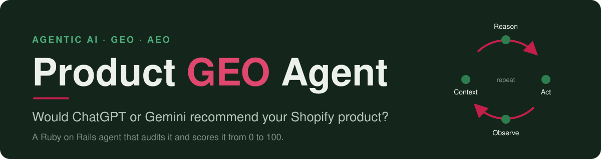
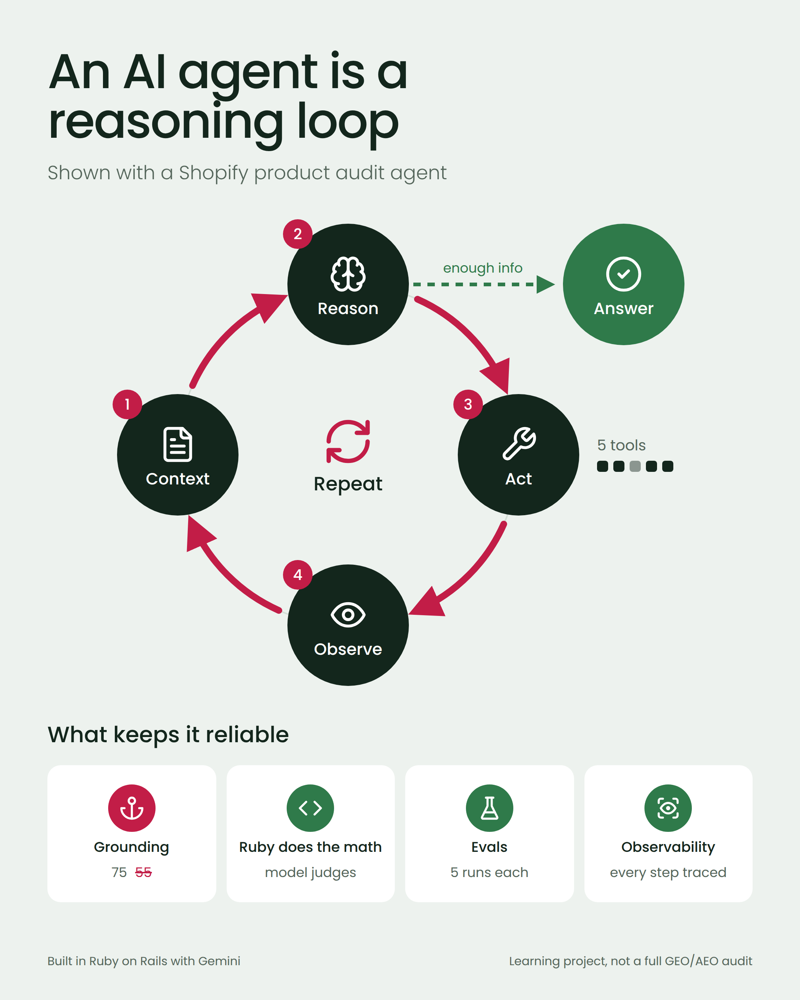

<h1 align="center">
  
</h1>

<p align="center"><strong>Learn how an AI agent works by watching one audit a real Shopify product.</strong></p>

<p align="center">
  <a href="https://github.com/mjesar/product_geo_agent/actions/workflows/ci.yml"></a>
  
  
  
  
</p>

**ProductGeoAgent is an agentic generative AI tool that checks whether AI shopping assistants (ChatGPT, Gemini, Perplexity, Google AI Overviews) can find, understand and recommend a Shopify product.** It is a Ruby on Rails command-line agent that scores a product's AI discoverability from 0 to 100 and names the top gaps to fix.

Built as a hands-on agentic AI learning project in Ruby, using the [`little_ghost`](https://github.com/littleghostai/little_ghost) gem for tool calling and Gemini as the model.

## Why this exists

Most AI-readiness "audits" are SEO checklists with an AI label on them. This one asks the question that is specific to AI discoverability: would an AI assistant actually recommend this product?

It is also a project about building agents, and the most useful thing it taught me is that **a green test suite can sit on top of a broken agent.** Every test passed while a bug in the agent framework silently stopped my hooks (the retry handling and the tool-result collection among them) from running on real audits. Mocked tests could not catch it, because mocks assume the connection already works. Only running the real agent did. That is why this repo has two layers of checking: [RSpec specs](docs/agent-concepts.md#specs-vs-evals) for the code, and an [eval harness](docs/evals.md) for the agent's judgment.

## See it work

<p align="center">
  
</p>

<details>
<summary>Text version of the diagram</summary>

An AI agent is a loop, not a single model call. It repeats four steps until it has enough information to answer:

1. **Context**: the task, the instructions and everything learned so far.
2. **Reason**: the model decides what to do next. When it has enough information, it moves to the final answer.
3. **Act**: the model asks for one of five tools, and the app runs it.
4. **Observe**: the tool's result becomes new context, and the loop starts again.

Four things keep the agent reliable: **grounding** (the explanation must match the real data), **Ruby does the math** (the model only judges, plain code calculates the score), **evals** (the real agent is run several times per product) and **observability** (every step is traced).

</details>

<!-- Paste the video's user-attachments URL on its own line below to embed it (drag the MP4 into GitHub's web editor to get one). -->

Three real audits, one run each, against a sandbox Shopify store:

| Product | Score | What the agent found |
|---|---|---|
| The Complete Snowboard | **70 / 100** | Full product description and complete `Product` schema. Lost points for no FAQ (15) and no AI recommendation (15). |
| The Videographer Snowboard | **33 / 100** | `Product` schema present, but the text left out buyer details like sizing and binding compatibility (20). No FAQ (15), not recommended by AI (15). |
| The Out of Stock Snowboard | **10 / 100** | Empty description (it lost points for that and for unanswered buyer questions), `Product` schema present but incomplete, no FAQ. |

These are single runs, so treat them as a demonstration. Across five eval runs the complete snowboard scored between 65 and 70, which is why the harness exists.

## How the agent works: the reasoning loop

An agent looks at what it knows, decides what it needs next, takes an action, checks the result and decides again, until it can answer. A normal model call is `Question → Answer`. An agent is `Context → Reason → Act → Observe → Repeat → Answer`. Here is each step in this app:

1. **Context.** The task ("audit this Shopify product") plus the instructions in [`app/prompts/geo_audit/system_prompt.erb`](app/prompts/geo_audit/system_prompt.erb).
2. **Reason.** Gemini reads the context and decides what it needs, for example "to judge this product I need its details."
3. **Act (tool calling).** A model cannot read a store or a web page by itself. It asks for a tool, the app runs it and the result goes back to the model. The agent has five:

   | Tool | What it checks |
   |---|---|
   | `get_product_data` | Title, description, images and alt text, variants, SEO fields (Storefront API) |
   | `check_faq_page` | Whether the store has a FAQ page |
   | `check_faq_metafield` | A FAQ stored on the product itself. Only runs when the FAQ page finds nothing |
   | `check_structured_data` | `Product` and `FAQPage` schema.org JSON-LD on the live product page |
   | `check_ai_citation` | Asks an LLM for a recommendation and checks whether the product comes up |

4. **Observe.** The tool result becomes new context and the agent reasons again. The clearest example is the FAQ fallback: if `check_faq_page` finds nothing, the agent tries `check_faq_metafield` before concluding there is no FAQ.
5. **Repeat, then answer.** The loop continues until the agent has enough to rate the product. In practice, all five tools ran on every audit so far. The one conditional branch is the FAQ fallback.

The code that runs this loop around the model is called the **agent harness**. Here it is built on `little_ghost`. The agent class is [`GeoAuditAgent`](app/agents/geo_audit_agent.rb).

## Quick start

```bash
bundle install
bin/rails db:create db:migrate
cp .env.example .env        # then fill in your keys (see Setup below)
bin/audit the-out-of-stock-snowboard
```

You see the agent work as it happens:

```
→ Thinking...                                        (1.8s)
  ✓ get_product_data → "The Out of Stock Snowboard" · 1 variant · $885.95
→ Thinking...                                        (1.1s)
  ✓ check_faq_page → no FAQ page found
→ Thinking...                                        (1.0s)
  ✓ check_faq_metafield → no FAQ metafield found
→ Thinking...                                        (1.3s)
  ✓ check_structured_data → Product schema: incomplete · FAQ schema: no
→ Thinking...                                        (1.7s)
  ✓ check_ai_citation → not mentioned as a recommendation
  Score: 10 / 100
```

To check whether the agent's judgment holds up, run the evals (they make real Gemini calls, so they are never part of the normal test run):

```bash
bin/eval                       # every product in the expectations file, 5 audits each
bin/eval the-complete-snowboard
```

| Flag for `bin/audit` | What it does |
|---|---|
| `--verbose` | Also print each tool's full raw input and result, for debugging |
| `--trace` | Write a redacted, JSON-lines trace of every event (including the real request and response sent to the model) to `traces/` |
| `--trace-path=PATH` | Same, but write to `PATH` instead of the default auto-generated filename |

## What are GEO and AEO?

**GEO (generative engine optimization)** means making your content easy for generative AI tools such as ChatGPT, Gemini and Perplexity to understand, quote and recommend. **AEO (answer engine optimization)** is the same idea aimed at direct answers: a clear FAQ, specific product details and machine-readable markup (schema.org JSON-LD) give an assistant something concrete to cite. Classic SEO is about ranking in a list of links. GEO and AEO are about being the answer.

## How the score works

Seven checks add up to 100. The model rates three of them as poor, fair or good (none, half or full points). Plain Ruby calculates everything else, and the total.

| Check | Points | Decided by |
|---|---|---|
| Answers common buyer questions | 20 | Model rating |
| Description quality and length | 15 | Model rating |
| Variants and specs are clear | 10 | Model rating |
| Alt text on images | 10 | Code |
| FAQ content (page or metafield) | 15 | Code |
| Structured data (`Product` / `FAQPage`) | 15 | Code |
| AI recommends the product | 15 | Code |

The source of truth is `WEIGHTS` in [`app/services/geo_audit/score.rb`](app/services/geo_audit/score.rb). The [user guide](docs/user-guide.md) walks through each check with real audit output.

## What keeps the agent reliable

- **Grounding.** The explanation has to match the real data. In one audit the code calculated 75 points lost, but the model wrote "55". It reasoned correctly from what it was given and still added wrong, because generating text one word at a time is not arithmetic. The fix was to move all arithmetic into Ruby and let the model describe only finished, correct results. [Full write-up](docs/agent-concepts.md#grounding-keeping-the-models-words-tied-to-real-facts).
- **Code for exact work, the model for judgment.** The model rates three things. Ruby calculates the score, so the same facts always give the same number.
- **Tests versus evals.** Tests prove the code runs. The [eval harness](docs/evals.md) runs the real agent several times per product and compares the results with expectations written by hand beforehand. On the blank test product the score was 25 in all five runs. On the complete snowboard it stayed between 65 and 70.
- **Observability.** A live trace of every tool call, what it found and how long it took, so the agent is never a black box.

Calibrating the score against three sandbox products turned up two grounding failures: stale evidence (a check got stricter, but the sentence describing its failure did not) and unreliable arithmetic (the "55" above). Each fix was verified on one run per product, which confirms direction, not stability, so I built the eval harness to measure stability.

## Learn more

- [`docs/user-guide.md`](docs/user-guide.md): plain-language guide to what the tool does, with real audit outputs (no code reading needed)
- [`docs/agent-concepts.md`](docs/agent-concepts.md): running notes on agent concepts learned while building this (tool calling, grounding, specs versus evals)
- [`docs/evals.md`](docs/evals.md): how the eval harness checks whether the agent's ratings hold up
- [`docs/faq.md`](docs/faq.md): short answers on building AI agents with Ruby on Rails and on checking whether AI assistants can recommend a Shopify product
- [`docs/development-plan.md`](docs/development-plan.md): the step-by-step build plan, one branch and PR per step
- [`docs/shopify-auth-setup.md`](docs/shopify-auth-setup.md): how the Storefront API token was set up
- [Architecture map](https://claude.ai/artifact/PrAVHZAaoiwTp3bQYcqCPk): diagrams of the system architecture, the agent's decision flow and the dev workflow

Common questions, answered in the FAQ:

- [How do I build an AI agent in Ruby on Rails?](docs/faq.md#how-do-i-build-an-ai-agent-in-ruby-on-rails)
- [What is tool calling (function calling), and how does it work in Ruby?](docs/faq.md#what-is-tool-calling-function-calling-and-how-does-it-work-in-ruby)
- [How do I stop an LLM from getting numbers wrong?](docs/faq.md#how-do-i-stop-an-llm-from-getting-numbers-wrong)
- [How do I test an AI agent with RSpec?](docs/faq.md#how-do-i-test-an-ai-agent-with-rspec)
- [How do I check whether ChatGPT or other AI assistants can recommend my Shopify product?](docs/faq.md#how-do-i-check-whether-chatgpt-or-other-ai-assistants-can-recommend-my-shopify-product)
- [Does it work with BigCommerce?](docs/faq.md#does-it-work-with-bigcommerce)
- [Can I trust the score?](docs/faq.md#can-i-trust-the-score)

## Setup

```bash
bundle install
bin/rails db:create db:migrate
cp .env.example .env   # then fill in your keys
```

Required environment variables:

- `GEMINI_API_KEY`: Gemini API key (free tier), used by the agent's model and the AI citation check tool
- `SHOPIFY_STOREFRONT_TOKEN`: Shopify Storefront API access token (read-only)
- `SHOPIFY_STORE_DOMAIN`: e.g. `your-sandbox-store.myshopify.com`
- `SHOPIFY_STOREFRONT_PASSWORD`: only needed if the store is password-protected (see [`docs/shopify-auth-setup.md`](docs/shopify-auth-setup.md))

## Tech stack

- Ruby 4.0 and Rails 8.1
- [`little_ghost`](https://github.com/littleghostai/little_ghost) for the agent and tool-calling loop
- Gemini API (generative AI model, free tier) as the model provider
- Shopify Storefront GraphQL API (read-only, no OAuth app install required)
- PostgreSQL
- RSpec for tests, with no live network calls in the normal suite

## Status

Working end to end: five tools, `GeoAuditAgent` wiring them together with a real reasoning loop, deterministic scoring, retry and backoff for rate limits, usage tracking, a CLI (`bin/audit`) with a live trace, and an eval harness (`bin/eval`) that has run on two products so far. It is a learning project, not a complete GEO/AEO audit, so expect rough edges. It reads one product at a time and never writes to the store.

## Related work

This project covers agents and tool calling end to end. For the other two pillars of this agentic-commerce work, MCP server design and RAG (pgvector and Voyage embeddings), see [`shop_mcp_server`](https://github.com/mjesar/shop_mcp_server), a separate project exposing a Shopify-style store to LLM agents.
