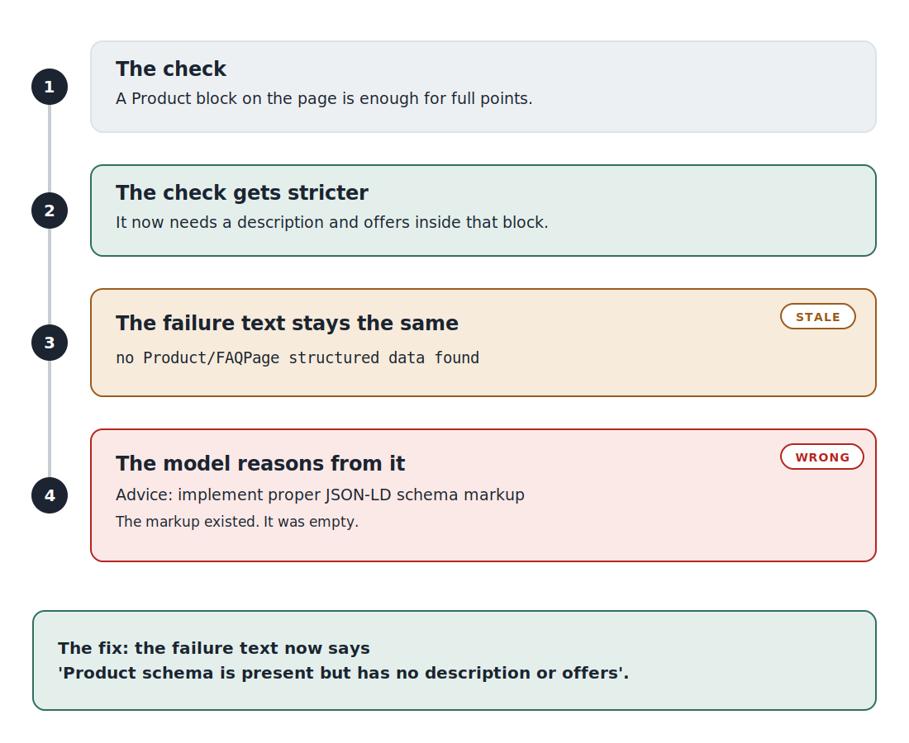
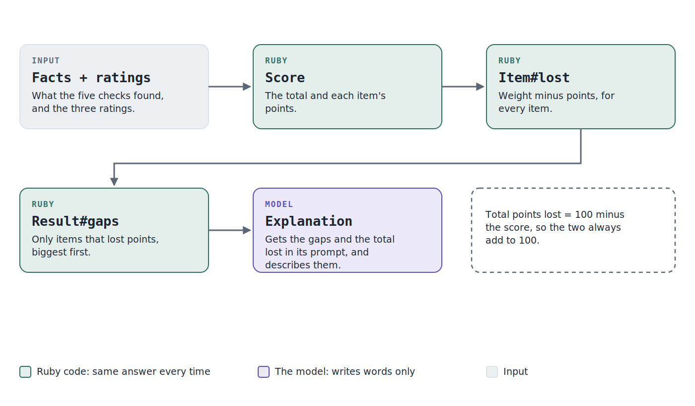
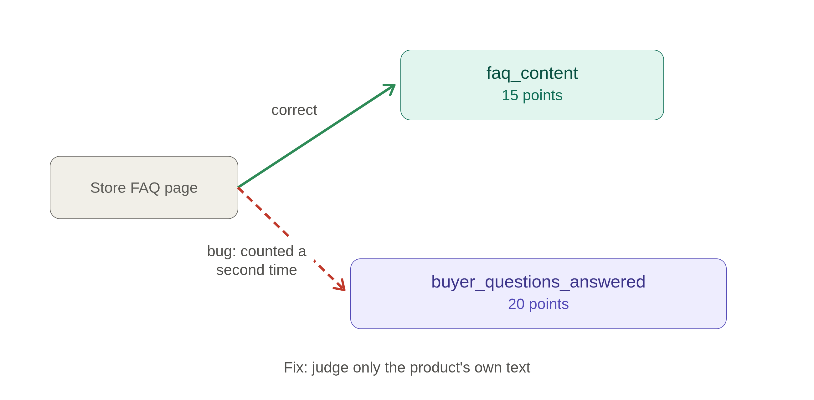

# AI agent concepts: tool calling, grounding and evals in Ruby with Gemini

Learning notes on building an agentic generative AI tool in Ruby on Rails, with the
[`little_ghost`](https://github.com/littleghostai/little_ghost) gem and Gemini. They
cover what makes something an AI agent and not a single API call, how tool calling and
system prompts work, how to keep a model's output grounded in real facts, and how evals
differ from tests. Every concept is explained with a real example from `ProductGeoAgent`,
a GEO/AEO audit agent for Shopify products. Update this as new concepts come up during
the build. It is the learning record, not just a technical doc.

## What makes something an "agent" vs. a single API call

A single LLM call is: send a prompt, get text back, done. An **agent** has a
**reasoning loop**: the model can look at real data (from a tool call) and decide what
to do next before giving a final answer. The loop is:

```
question → model reasons → (needs data? → call tool → get result → reason again) → final answer
```

The part in parentheses can repeat multiple times before the model is ready to answer.
That's the actual mechanism that makes it "agentic" rather than just "an API call
with extra steps."

## Tools

A tool is a function (in our case, a Ruby method) described to the model via a JSON
schema — name, description, and expected input parameters. The model doesn't run the
tool itself; it returns a structured "please call this tool with these arguments"
response, and *my code* actually executes it, then feeds the result back into the
conversation for the model to reason over.

Each round-trip (model decides → my code executes → result goes back) is a separate
API request. A single user question might cost several requests if the agent needs
multiple tool calls before it can answer.

## Why multiple granular tools instead of one combined tool

Two ways to structure tool access:
- **One mega-tool** that internally runs all the checks and returns one big result.
  Simple, but the *agent* isn't deciding anything — my Ruby code is doing all the
  orchestration, and the LLM is just summarizing what it's handed.
- **Multiple granular tools**, where the agent itself decides which to call, in what
  order, and whether to retry with a different one. This is what makes the reasoning
  loop actually meaningful — the model is making real decisions, not just passing
  through a fixed pipeline.

Chose the second for `ProductGeoAgent`, specifically so the agent can:
- Skip deeper checks on a product whose description is already strong
- Try `check_faq_page` first, and only fall back to `check_faq_metafield` if that
  comes back empty

## Self-correction / conditional retry

Borrowed from the "agentic RAG" idea (a retrieval agent decides whether to retrieve at
all, and can retry with a different approach if the first attempt didn't help). Applied
here as: if `check_faq_page` finds nothing, the agent tries `check_faq_metafield`
before concluding there's genuinely no FAQ content — rather than giving up after one
failed lookup. This is driven by the system prompt's instructions, not fixed
if/else logic in Ruby — the *model* decides to retry.

## System prompts

**System prompt vs. user message**

A **user message** is the specific ask for one turn — "Audit the Shopify product with
handle 'the-complete-snowboard'." A **system prompt** is standing instructions the
model follows on *every* message in the conversation, regardless of what the user
message says. `GeoAuditAgent`'s system prompt (`app/prompts/geo_audit/system_prompt.erb`)
never mentions a specific product — it says what an audit *is*, what order to run the
five tools in, and how to score the result. The user message just supplies the one
thing that varies: which product handle to run it against.

Think of the system prompt as the job description, and the user message as the
specific work order for today.

**Practices for writing one** (cross-checked against `system_prompt.erb`):

- **Role and goal first.** Before any instructions, say what the model *is* and what
  it's for. `system_prompt.erb` opens with "You audit a single Shopify product for how
  discoverable it would be to AI shopping assistants" — that framing shapes everything
  that follows, since "for AI assistants" produces different judgment than "reads well
  to a human" would.
- **Explain why, not just what.** "Never pass the product's own name into the question
  you'd ask — the point is whether it comes up unprompted" tells the model the *reason*
  for the rule, not just the rule. A model that understands why is more likely to apply
  the same judgment correctly to a case the prompt didn't spell out explicitly.
- **Say what to do, not only what not to do.** A rule like "don't stop after
  check_faq_page finds nothing" only describes a gap. "Call check_faq_metafield before
  concluding there's no FAQ content" tells the model the actual next action to take.
- **Strategy, not a script.** The prompt says try X first, fall back to Y if X finds
  nothing, always run Z last — it doesn't hardcode "if description.length < 50 then...".
  The model fills in the actual decision at runtime based on what each tool call
  returns. A literal step-by-step script would just be Ruby wearing a prompt as a
  costume, and would defeat the point of having an agent at all.
- **Cover edge cases explicitly.** "If it finds nothing" (empty FAQ result), "once you
  already know the product's title" (an ordering dependency) — naming edge cases in the
  prompt is cheaper than discovering the model mishandles them during a real run.
- **Specify the output format.** The rubric table plus "finish with the overall score
  and the top 2-3 gaps" tells the model exactly what shape the final answer needs, not
  just what to think about along the way.
- **No contradictions.** A prompt that says "be thorough" in one line and "be concise"
  in another forces the model to guess which one wins — conflicting instructions can
  degrade a model's output in unpredictable ways, worse than either instruction alone.
- **Test changes with evals, not vibes.** A wording change can shift model behavior in
  ways that read fine on the page but don't hold up in a real run (see the eval
  harness step in `docs/development-plan.md`).
  A prompt is code that happens to be written in English, and needs the same "does this
  actually work" verification any other code change gets.

**Tool descriptions are prompts too**

It's tempting to think only the system prompt counts as "the prompt" and tool
definitions are just plumbing, but every tool's `description` field is also read by the
model at decision time — it's how the model decides *which* tool to call and *when*.
`GetProductDataTool`'s description ends with "Always call this first — the
description's length and quality determine how deep the remaining checks need to go,"
which is doing real prompting work, not just documentation. A vague tool description
("fetches product data") gives the model far less to reason from, even sitting under a
well-written system prompt.

**System prompt vs. prompt engineering vs. context engineering**

These get used interchangeably but mean different things:
- A **system prompt** is one specific artifact: the standing instructions text itself.
- **Prompt engineering** is the practice of writing and iterating on prompt text
  (system prompts, user messages, tool descriptions) to get better model behavior —
  wording, examples, structure.
- **Context engineering** is the broader discipline: deciding *everything* that ends up
  in the model's context window before it responds — which tools are available, what
  data a tool call returns and in how much detail, what's summarized vs. included in
  full, what conversation history is kept vs. dropped. The system prompt is one piece
  of the context; so is every tool result the agent has accumulated by the time it
  makes its final decision. Prompt engineering optimizes the words; context engineering
  optimizes what's in the room at all.

**What belongs in code vs. in the model**

Originally, `system_prompt.erb` asked the model to calculate the final score out of 100
itself, by reading the rubric table and doing the weighted arithmetic in its head.
That was the wrong split of responsibility: arithmetic is exactly the kind of thing a
language model is bad at being *consistent* about — the same tool results could produce
a slightly different score on two different runs, since nothing about token-by-token
generation guarantees the same arithmetic twice.

This has since been built (Step 7, `docs/development-plan.md`) — score calculation now
lives in Ruby, computed from the tool results the agent already collected, and the
model is only ever asked for judgment it's actually suited to give. The general rule
this suggests: if a step has one deterministic correct answer, do it in code; if a step
requires judgment over unstructured content, that's where the model earns its keep. The
next section covers the two mechanisms that made the split possible.

## Hooks and structured output: how the score actually left the model

Two `little_ghost` mechanisms made Step 7 possible, and both are patterns that apply
well beyond scoring.

**Lifecycle hooks.** `little_ghost` fires callbacks at points in the agent's tool
loop — `before_tool`, `after_tool`, `before_model`, `after_model`, and more.
`GeoAuditAgent` uses `after_tool` to copy every tool's raw Ruby return value into
`context.state`, a plain hash that travels with the run and survives to the end of it
as `run.result.state`. This is the general pattern for pulling data *out* of an agent
run without re-parsing the conversation afterward: hook into the moment the data
exists, stash it somewhere durable, and read it back once the run finishes.

**Structured output (`result_schema`).** By default, an agent's final answer is free
text. `result_schema` changes that: it forces the final message into a strict JSON
shape, validated against a schema, with one automatic repair attempt if the model's
first try doesn't fit. `GeoAuditAgent` uses this to get back exactly three ratings
(`poor`/`fair`/`good` plus a one-sentence reason) instead of parsing a score out of a
paragraph of prose. The more general lesson: whenever Ruby needs to *do something*
with a model's output beyond displaying it, structured output beats asking nicely for
a specific format and hoping the text stays parseable.

**Two conversations, not one.** `GeoAudit::Score` reads `run.result.state` and
`run.result.structured_result.value` and computes the final number in plain Ruby —
that's the deterministic half. Explaining that number in readable prose still needs a
model, but not *this* model's conversation, and no tools at all. So it's a second,
independent call (`GeoAudit::GapsExplanation`, following the same plain
`LittleGhost.generate` pattern as `GeoAudit::CitationCheck` rather than a full second
`Agent`) that receives the finished score rendered as plain text and writes 2-3
sentences about it. It has no memory of the tool-calling run and no way to change the
number — it can only describe what Ruby already decided. The score itself is
reproducible for the same tool results and ratings every time; only the wording of its
explanation can vary between runs, which is a contained, acceptable kind of
nondeterminism compared to letting a model do the arithmetic itself. (Step 9 later
found that even *describing* a score needs care, see the Grounding section below.)

## What a "trace" looks like

For a real audit, the sequence of tool calls (the trace) is the interesting part to
watch — e.g.:
```
get_product_data → (thin description) → check_faq_page (empty) →
check_faq_metafield (empty) → check_structured_data (missing) →
check_ai_citation (not mentioned) → final score + gaps
```
Different products will produce different traces depending on what the agent finds
along the way — that variability is the actual demonstration of "the agent is
deciding," not just executing a fixed script.

## Specs vs. evals

RSpec specs and evals answer different questions, and it's worth keeping them
distinct rather than expecting one to stand in for the other:

- **Specs prove the code handles the model's requests correctly.** Given that the
  model asked to call `check_faq_page`, does the tool return the right shape? Given a
  missing product, does it raise the right error? These are deterministic questions
  with a correct answer, so they belong in RSpec with mocked model responses.
- **Evals prove the model's decisions are good.** Given the system prompt, does the
  model actually choose to call `check_faq_page` before `check_faq_metafield`? Is the
  final score reasonable? These aren't deterministic, an LLM can make a different
  (even correct) choice on a different run, so no mock can honestly answer them —
  only real runs against real products, compared to a hand-scored expectation (the
  eval harness, step 10), can.

`GeoAuditAgent`'s own spec suite reflects this split: `geo_audit_agent_spec.rb`
checks wiring only (tools registered, system prompt content) — no mocking of
multi-turn model behavior was built, since a fake model response would only prove
Ruby handles that fake response correctly, never that the real model would choose it.
`geo_audit_agent_live_spec.rb` is the one place that runs the real agent against a
real product with the real model — tagged `:live` and excluded from the default
suite, since it costs real Gemini quota and depends on the sandbox being reachable.

That first live run immediately proved the value of keeping it separate: it surfaced
a real bug (Gemini's `thought_signature` requirement for multi-turn tool calls isn't
supported by `little_ghost` 0.10.0's Gemini adapter — see Known limitations in
`CLAUDE.md`) that no mocked spec could ever have caught, since every mocked spec
necessarily assumes the model/adapter round-trip already works.

## Grounding: keeping the model's words tied to real facts

**What grounding means.** A model is "grounded" when what it says stays tied to the
facts it was actually given, instead of drifting away from them. Picture someone
reading a report aloud to a client. If they read exactly what is on the page, the
client hears the truth. If the page is out of date, or they start doing sums in their
head, the client hears something wrong, even though the reader was being honest.

That is exactly the last step of this app. Once the score is worked out,
`GeoAudit::GapsExplanation` (`app/services/geo_audit/gaps_explanation.rb`) hands a
model the finished breakdown and asks it to explain the biggest gaps to the store owner
in plain English. Everything it should say is already on the page. Step 9 found that it
still got things wrong, in two different ways, plus a third closely related problem.

**Failure 1: the evidence went stale.** When the structured data check was made
stricter, a blank product started scoring 0 for it. But the sentence that describes
that failure (in `structured_data_item`, `app/services/geo_audit/score.rb`) still said:

> no Product/FAQPage structured data found

What was actually true: the page *did* have a Product block (every Shopify theme adds
one), but its description was empty. What the model told the owner, reasoning correctly
from the sentence it had:

> implement proper JSON-LD schema markup

That is sensible advice for the sentence and wrong for reality. The markup existed. The
real fix was writing a product description.

This is worth separating from the usual idea of a hallucination. The model did not make
something up from nothing. It described reality wrongly because the text it was given no
longer matched reality. I call that a **grounding failure caused by stale evidence**.

The fix: `score.rb` now says "Product schema is present but has no description or
offers" for that case, and `app/services/geo_audit/tool_summary.rb` prints "Product
schema: incomplete" in the terminal. The next run told the owner to add a description
and offers to the existing schema. The lesson: every sentence the model reads is
evidence. When a check's meaning changes, every sentence describing its result has to
change too, and a spec should pin the wording (`spec/services/geo_audit/score_spec.rb`
checks the exact text for both the "incomplete" and "nothing at all" cases).



*The check changed at step 2, but the sentence describing its failure (step 3) did
not, so the model's advice at step 4 was right for the old check and wrong for reality.*

**Failure 2: it added the numbers up wrong.** The model was given correct per-item
points and still wrote things like "losing 55 points" when 75 had been lost, and "30
points" for two gaps worth 35 together (20 + 15).

Why: a model writes one word at a time and has no calculator inside it. Adding several
numbers while it is still writing the sentence is a guess that is usually right and
sometimes not. It is the same reason scoring moved out of the model in Step 7.

The obvious alternative was better wording in the prompt, something like "be careful
when adding". But a prompt can only *ask* for correct arithmetic, and code can
*guarantee* it. So the subtraction and the sorting moved into Ruby, in
`app/services/geo_audit/score.rb`:

- `Item#lost` is weight minus points (a "fair" description gets 7.5 of 15, so 7.5 is
  lost). It rounds to one decimal, and whole numbers come back as integers so they
  print as `10`, not `10.0`.
- `Result#gaps` returns only the items that lost points, biggest loss first. Ties keep
  the rubric's own order (the original position is part of the sort key), so the order
  is the same on every run.
- `Result#total_lost` is `100 - total`, not the sum of the item losses. The reason is
  rounding: a total of 77.5 rounds to 78, but the item losses add up to 22.5, and 78 +
  22.5 is 100.5. Using `100 - 78 = 22` guarantees the score and the points lost always
  add to 100.

The prompt template (`app/prompts/geo_audit/gaps_explanation.erb`) then only prints
those finished values, for example for the middling product:

```
Total score: 48 / 100
Total points lost: 52

Gaps, biggest loss first (only items that lost points are listed):
- Answers common buyer questions: lost 20 of 20 points. ...
- AI citation check: lost 15 of 15 points. ...
- Clear specs/variants: lost 10 of 10 points. ...
```

and tells the model to copy every number exactly and never add, subtract or combine
them. On the three sandbox products, every number the explanation quoted then matched
the breakdown (total points lost 20, 52 and 75), and the model never tried to add the
per-item losses together.



*The green steps are plain Ruby and give the same answer every time for the same facts.
Only the last step is the model, and it receives finished numbers.*

**A third, related cause: an instruction that was too vague.** The store has one FAQ
page, and it already earns its own 15 points under `faq_content`. The instruction for
`buyer_questions_answered` in `app/prompts/geo_audit/system_prompt.erb` said "good if it
proactively covers things a buyer would ask" without saying what "it" was. The model
counted the store FAQ page again, so the middling product jumped from 33 to 68 the moment
the page existed, when the expected score was 48. One sentence fixed it (judge only the
product's own content), and the next run matched the prediction exactly: 85 / 48 / 40.
This was neither stale evidence nor bad arithmetic. The wording let evidence from one
check leak into another rating.



*The green arrow is the FAQ page earning its own 15 points. The red dashed arrow is the
bug: the same page also boosted the 20-point buyer-questions rating.*

**How this connects to the rest of this file.**

- *Code vs. model* (see "What belongs in code vs. in the model" above): that section
  said arithmetic with one right answer belongs in code. Step 7 applied the rule to the
  score. This applies the same rule to the sentences *about* the score: if the
  explanation needs a number, compute it first and hand it over.
- *Two conversations, not one*: that section says the explanation "can only describe
  what Ruby already decided". That is true of the score, but describing still involves
  choosing which numbers to state and how to combine them, and that is where Failure 2
  crept in. Give the model finished numbers there too.
- *Specs vs. evals*: the specs in `spec/services/geo_audit/gaps_explanation_spec.rb`
  check what the prompt *says* (which gaps it lists, and that it tells the model not to
  add). They cannot tell whether the model obeys. The only way to know was to run the
  real agent and check every number it quoted against the breakdown by hand, which is a
  small manual eval. It was one run per product, so it confirms direction, not
  stability. The good product's `specs_clarity` rating also flipped between fair and
  good on the same listing, which is the reason the eval harness (Step 10 in
  `docs/development-plan.md`) exists.

**A quick checklist for next time.** After changing any check or prompt:

1. Does every sentence that describes a check's result still match what the check now
   means? (stale evidence)
2. Does the model have to add, subtract, count or sort anything? Move it into Ruby.
   (arithmetic)
3. Could one piece of evidence be counted by two different ratings? Say which one owns
   it. (scope)
4. Run the real agent, and compare each number in the output to its source.

## Open questions / things to learn next

**Answered since this section was first written**
- *Does the prompt's exact wording change whether the agent behaves as intended?* Yes,
  repeatedly. The clearest case is the store FAQ page being counted a second time in
  `buyer_questions_answered` until one sentence in `system_prompt.erb` fixed it (see "A
  third, related cause" in the Grounding section, and "System prompts" above).
- *Can I see what the agent did?* Yes: which tool it chose, with what inputs, what came
  back and how long it took. See "Hooks and structured output" and "What a trace looks
  like". What this does not show is *why*, which is the first open question below.

**Still open**
- **Does the agent ever skip a check?** The system prompt tells it to use the
  description to judge how deep to go, and to skip checks on a product that is already
  strong. No real audit so far has skipped a tool: every run has called all five. So
  the "agent decides" claim is untested in the one direction that would prove it.
  Step 10's eval harness should include a strong product and record which tools were
  called. This is something to measure there, not something to fix now.
- **Why did it pick that tool?** Hooks and `--trace` record the choice ("chose tool
  `check_faq_page`") but a real trace shows each turn's response as a bare tool call,
  with no reasoning text in it. Whether `little_ghost` or Gemini can expose the model's
  reasoning for a step, or whether the prompt would have to ask for it, is unknown.
- **What happens on an unknown tool or malformed arguments?** Never seen in a real run
  or a spec here. Reading the gem's source, an unknown tool name raises a `ToolError`
  and invalid input produces a feedback message for the model, so the intent is to hand
  the error back and let it retry, but that is from the code, not from watching it
  happen. The closest thing observed is different: a tool's own `ToolError` on a
  missing product, after which the model carried on anyway (now prevented by the
  `Auditor` pre-check, not by the model).
- **Is the FAQ fallback reliable on other products?** On
  `the-collection-snowboard-liquid`, with the store FAQ page hidden and a real
  `custom.faq` metafield, the agent called `check_faq_page`, found nothing, then called
  `check_faq_metafield` and found the content in all 10 audits (two eval batches of
  five). That is one product with an easy, near-empty listing, so it shows the path
  works end to end, not how often the model takes it when the product has a strong
  description that might make it skip checks.
